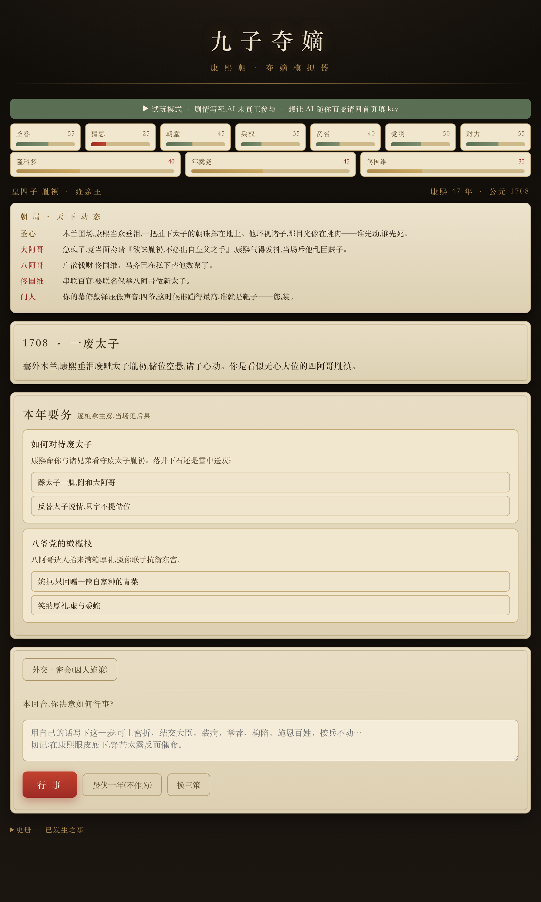
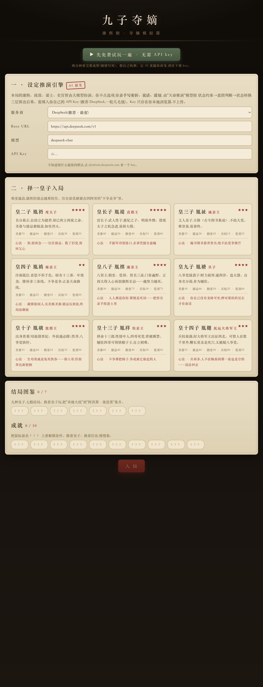
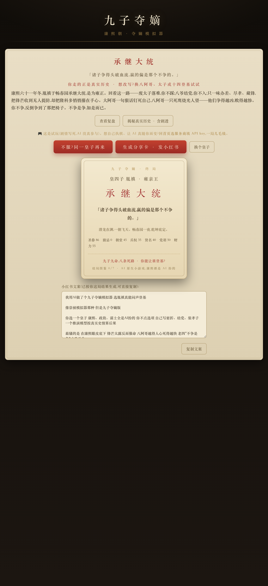

<h1 align="center">九子夺嫡模拟器</h1>

AI 原生文字策略游戏 · 康熙朝九子夺嫡

  <a href="https://persdre.github.io/jiuzi-duodi/"><b>▶ 在线游玩</b></a> &nbsp;·&nbsp;
  打开就能点「免费试玩」,两分钟看完整流程,<b>无需 API key</b>

康熙朝,储位空悬,九子夺嫡。你选一位皇子,**康熙、政敌、谋士、权臣全由大模型扮演**——你不点固定选项,而是亲手写密折、结党、装孝子、经营权臣,由"天命推演"模型按真实史情算出后果。

在康熙眼皮底下,**锋芒太露反而催命**。九个皇子,九条贴着各自历史死穴的窄路。

> 九子九命,八条死路。你能让谁登基?

## 截图

| 选一位皇子入局 | 走到终局 · 一键生成分享卡 |
|:---:|:---:|
|  |  |

## 怎么玩

1. 打开 **https://persdre.github.io/jiuzi-duodi/** 。
2. 想正式玩:在「服务商」里选 **DeepSeek**(最省,一局几毛钱)或 **OpenAI**,填入**你自己的 API Key**。
3. 选一位皇子(新手推荐四阿哥),入局。
4. 每年:看朝局动态 → 处置 2-3 桩要务 → 密会经营隆科多/年羹尧/佟国维 → 写下你的行事 → 看推演与诸子反应。
5. 走到 1722 畅春园之夜,结算你的结局。

## 隐私与花费

- **你的 API Key 只存在你自己的浏览器本地(localStorage),绝不上传、不经过任何服务器。** 这是纯静态网页,没有后端。
- 用 `gpt-4o-mini` 或 DeepSeek,一整局约 **3–8 美分(人民币几毛钱)**。

## 玩法亮点

- **不争是争**:越急于露出夺嫡之心,死得越快;九条窄路各贴一条历史死穴。
- **改写历史**:让历史上输掉的人(八阿哥、太子、十四…)登基,解锁「✦ 改写历史」与「翻天」成就。
- **养成关系**:多年密会经营隆科多,养到归心,他会在终局那夜替你宣遗诏。
- **史实要务**:每年的事件扎根真实史情(南巡河工、噶礼张伯行互参案、千叟宴、西北用兵…)。
- **结局图鉴 + 成就**:七般结局、十项成就,换着皇子集齐。
- 结局可一键生成**分享卡 + 文案**。

## 技术

单文件 `index.html`,纯前端,OpenAI 兼容接口(DeepSeek / 通义千问 / OpenAI 皆可)。状态机 + 上下文记忆驱动的三层世界推演:状态约束 → 意图判断 → 状态转换。
